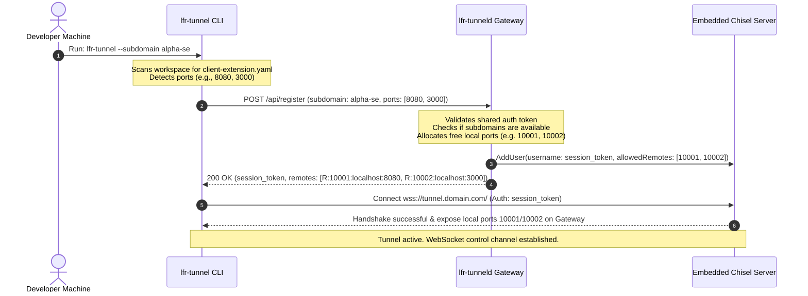
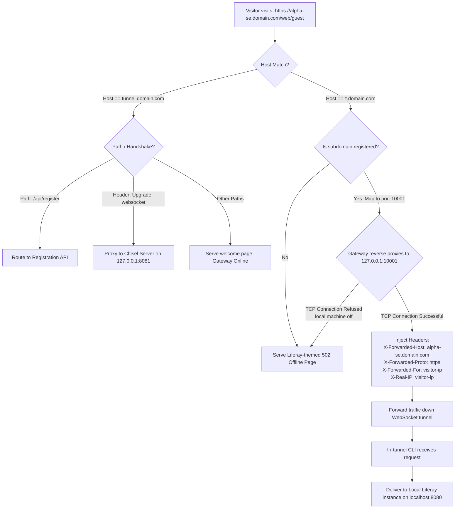

# Liferay Tunnel (lfr-tunnel) Routing & Architecture Guide

This guide provides a detailed technical overview of how `lfr-tunnel` handles dynamic subdomain routing, SSL offloading, Liferay header injection, and connection resilience.

---

## 1. Sequence Diagram: Registration & Handshake

This diagram shows the setup process when a developer starts the client CLI (`lfr-tunnel`). The client registers its ports, gets dynamic ports assigned by the gateway daemon (`lfr-tunneld`), and establishes the WebSocket control connection.



---

## 2. Flowchart: HTTP Request Routing & Header Injection

This flowchart explains the routing path of an incoming public HTTP/HTTPS request arriving at the gateway. It details how the request is matched, how headers are rewritten, and how offline fallbacks are served.



---

## 3. Deployment Topology (Production Setup)

In production, it is best practice to run a reverse proxy like **Caddy** or **Nginx** in front of `lfr-tunneld`. This setup simplifies wildcard SSL certificate acquisition (using Let's Encrypt DNS-01 or HTTP-01 challenges) and acts as the public TLS termination point.

```
                      ┌───────────────────────────────────────────┐
                      │              Public Internet              │
                      │       (DNS: *.liferay-tunnel.com)         │
                      └─────────────────────┬─────────────────────┘
                                            │ (HTTPS - Port 443)
                                            ▼
                      ┌───────────────────────────────────────────┐
                      │          Caddy / Nginx Server             │
                      │    - Terminated Wildcard SSL Certificate  │
                      │    - Forwards raw HTTP traffic to gateway │
                      └─────────────────────┬─────────────────────┘
                                            │ (HTTP - Port 80)
                                            ▼
                      ┌───────────────────────────────────────────┐
                      │          lfr-tunneld Gateway              │
                      │    - Listens on 127.0.0.1:80              │
                      │    - Coordinates /api/register            │
                      │    - Runs Chisel Server on localhost:8081 │
                      └─────────────────────┬─────────────────────┘
                                            │
                                  ┌─────────┴─────────┐
                        (Port 10001)│                 │(Port 10002)
                                    ▼                 ▼
                               ┌─────────┐       ┌─────────┐
                               │ Chisel  │       │ Chisel  │
                               │Session 1│       │Session 2│
                               └────┬────┘       └────┬────┘
                                    │                 │
              (WebSockets) ─────────┘                 └────────── (WebSockets)
```

---

## 4. Why Header Injection is Vital for Liferay

Liferay instances build internal redirects, absolute asset links, and OAuth redirect URIs using details from the incoming HTTP request. Without proper header configuration, using a reverse proxy results in broken links and infinite login redirect loops.

Here is how `lfr-tunnel` resolves this:

1. **`X-Forwarded-Host`**
   - **What it does**: Informs Liferay of the public-facing domain name (e.g., `alpha-se.domain.com`).
   - **Why Liferay needs it**: If the gateway forwards the request to `127.0.0.1:10001`, Liferay sees a local address. By injecting `X-Forwarded-Host`, Liferay respects the virtual host configuration and generates links pointing to the public domain name instead of `localhost`.
2. **`X-Forwarded-Proto`**
   - **What it does**: Tells Liferay whether the original request was encrypted (`https`).
   - **Why Liferay needs it**: Because Caddy/Nginx offloads SSL at the boundary, the connection down to `lfr-tunneld` and local Liferay is HTTP. If Liferay does not receive `X-Forwarded-Proto: https`, it will construct URLs using `http://` (unsecure), causing browsers to block mixed content or trigger OAuth redirect mismatches.
3. **`X-Forwarded-For` / `X-Real-IP`**
   - **What it does**: Passes the remote visitor's IP down the pipeline.
   - **Why Liferay needs it**: Used for security auditing, IP-based access policies, and audit logs inside the Liferay instance.

---

## 5. Client Resiliency & Self-Cleaning Resource Management

`lfr-tunnel` is designed for long-term server runtime with zero manual resource maintenance:

- **Infinite Reconnection Loop**: If a developer closes their laptop or loses internet connectivity, the `lfr-tunnel` CLI automatically reconnects in the background using an exponential backoff retry loop.
- **Dynamic Port Reclamation**: When the client goes offline, the gateway Chisel engine drops the TCP port listeners on the VPS. The gateway's cleanup loop detects this:
  1. Every 10 seconds, the gateway sweeps all active leases.
  2. It attempts a fast TCP dial check on `127.0.0.1:LocalPort`.
  3. If the connection fails (refused), the gateway deletes the session lease, frees the port back into the port pool, and removes the credentials from the Chisel user database via `DeleteUser(sessionToken)`.
  4. This prevents memory leaks and ensures developer subdomains are immediately freed for others to use if abandoned.

---

## 6. Supported Domains Constraint

The `lfr-tunnel` routing system is designed to only process, authorize, and resolve requests for subdomains under the following domains:

*   **`lfr-demo.se`**: The primary domain for Sales Engineering demonstrations.
*   **`lfr-demo.online`**: The secondary mirror domain.

Any dynamic registration requests (sent via `/api/register` with a `subdomain_prefix`) will be mapped exclusively to wildcards of these two domains. Any requests arriving at the gateway containing other host headers will be ignored by the routing plane.
