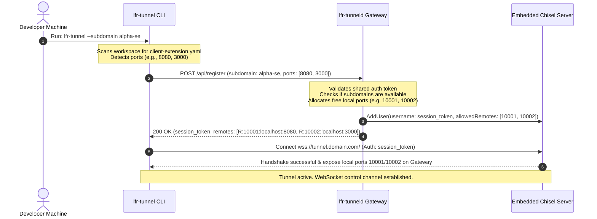
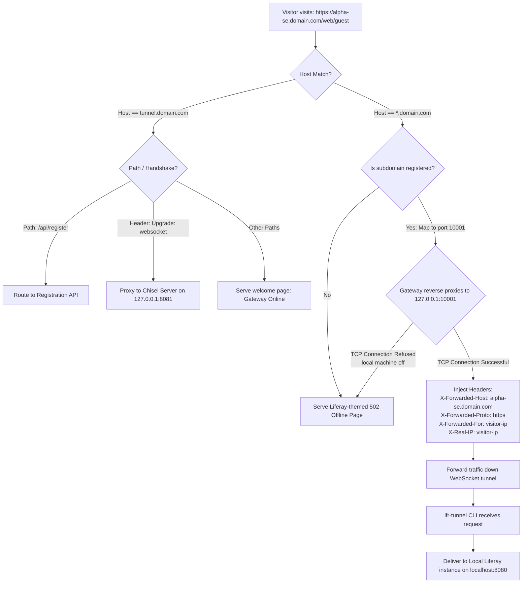
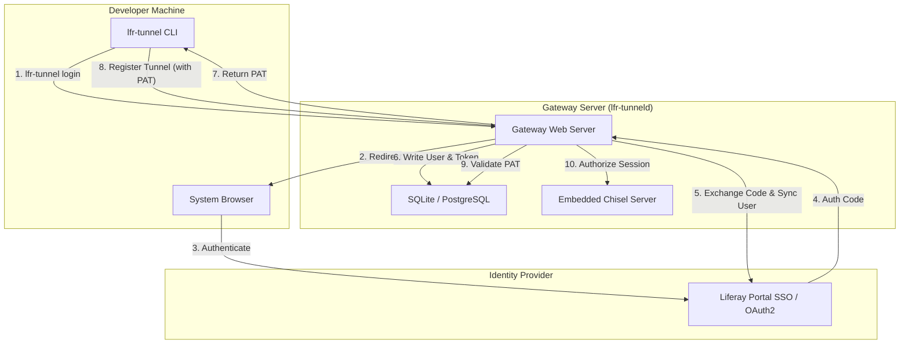
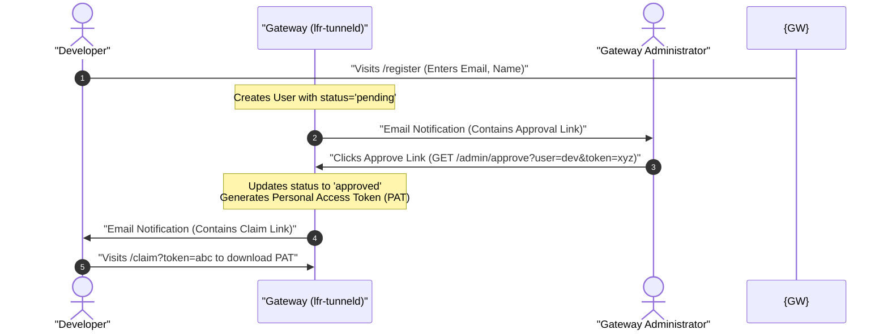
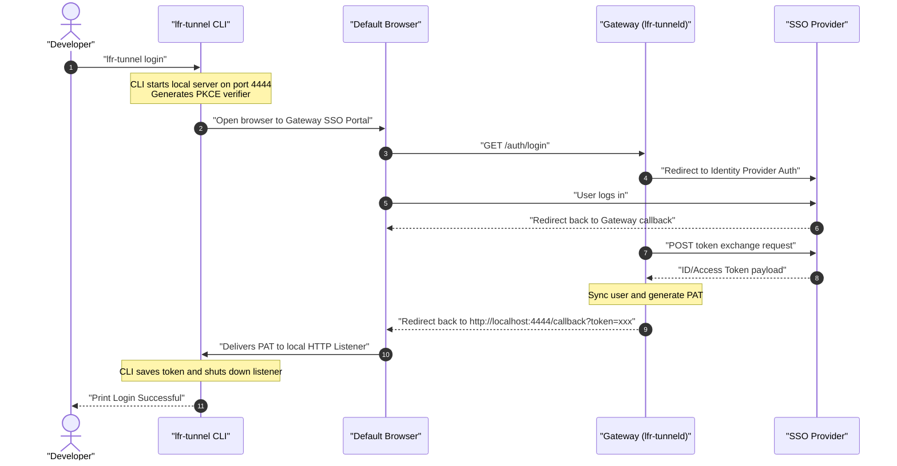

# Liferay Tunnel (lfr-tunnel) Routing & Architecture Guide

This guide provides a detailed technical overview of how `lfr-tunnel` handles dynamic subdomain routing, SSL offloading, Liferay header injection, connection resilience, user authentication, and data plane security.

---

## 1. Sequence Diagram: Registration & Handshake

This diagram shows the setup process when a developer starts the client CLI (`lfr-tunnel`). The client registers its ports, gets dynamic ports assigned by the gateway daemon (`lfr-tunneld`), and establishes the WebSocket control connection.



---

## 2. Flowchart: HTTP Request Routing & Header Injection

This flowchart explains the routing path of an incoming public HTTP/HTTPS request arriving at the gateway. It details how the request is matched, how headers are rewritten, and how offline fallbacks are served.



---

## 3. Deployment Topology (Production Setup)

In production, it is best practice to run a reverse proxy like **Caddy** or **Nginx** in front of `lfr-tunneld`. This setup simplifies wildcard SSL certificate acquisition (using Let's Encrypt DNS-01 or HTTP-01 challenges) and acts as the public TLS termination point.

```
                      ┌───────────────────────────────────────────┐
                      │              Public Internet              │
                      │       (DNS: *.liferay-tunnel.com)         │
                      └─────────────────────┬─────────────────────┘
                                            │ (HTTPS - Port 443)
                                            ▼
                      ┌───────────────────────────────────────────┐
                      │          Caddy / Nginx Server             │
                      │    - Terminated Wildcard SSL Certificate  │
                      │    - Forwards raw HTTP traffic to gateway │
                      └─────────────────────┬─────────────────────┘
                                            │ (HTTP - Port 80)
                                            ▼
                      ┌───────────────────────────────────────────┐
                      │          lfr-tunneld Gateway              │
                      │    - Listens on 127.0.0.1:80              │
                      │    - Coordinates /api/register            │
                      │    - Runs Chisel Server on localhost:8081 │
                      └─────────────────────┬─────────────────────┘
                                            │
                                  ┌─────────┴─────────┐
                        (Port 10001)│                 │(Port 10002)
                                    ▼                 ▼
                               ┌─────────┐       ┌─────────┐
                               │ Chisel  │       │ Chisel  │
                               │Session 1│       │Session 2│
                               └────┬────┘       └────┬────┘
                                    │                 │
              (WebSockets) ─────────┘                 └────────── (WebSockets)
```

---

## 4. Why Header Injection is Vital for Liferay

Liferay instances build internal redirects, absolute asset links, and OAuth redirect URIs using details from the incoming HTTP request. Without proper header configuration, using a reverse proxy results in broken links and infinite login redirect loops.

Here is how `lfr-tunnel` resolves this:

1. **`X-Forwarded-Host`**
   - **What it does**: Informs Liferay of the public-facing domain name (e.g., `alpha-se.domain.com`).
   - **Why Liferay needs it**: If the gateway forwards the request to `127.0.0.1:10001`, Liferay sees a local address. By injecting `X-Forwarded-Host`, Liferay respects the virtual host configuration and generates links pointing to the public domain name instead of `localhost`.
2. **`X-Forwarded-Proto`**
   - **What it does**: Tells Liferay whether the original request was encrypted (`https`).
   - **Why Liferay needs it**: Because Caddy/Nginx offloads SSL at the boundary, the connection down to `lfr-tunneld` and local Liferay is HTTP. If Liferay does not receive `X-Forwarded-Proto: https`, it will construct URLs using `http://` (unsecure), causing browsers to block mixed content or trigger OAuth redirect mismatches.
3. **`X-Forwarded-For` / `X-Real-IP`**
   - **What it does**: Passes the remote visitor's IP down the pipeline.
   - **Why Liferay needs it**: Used for security auditing, IP-based access policies, and audit logs inside the Liferay instance.

---

## 5. Client Resiliency & Self-Cleaning Resource Management

`lfr-tunnel` is designed for long-term server runtime with zero manual resource maintenance:

- **Infinite Reconnection Loop**: If a developer closes their laptop or loses internet connectivity, the `lfr-tunnel` CLI automatically reconnects in the background using an exponential backoff retry loop.
- **Dynamic Port Reclamation**: When the client goes offline, the gateway Chisel engine drops the TCP port listeners on the VPS. The gateway's cleanup loop detects this:
  1. Every 10 seconds, the gateway sweeps all active leases.
  2. It attempts a fast TCP dial check on `127.0.0.1:LocalPort`.
  3. If the connection fails (refused), the gateway deletes the session lease, frees the port back into the port pool, and removes the credentials from the Chisel user database via `DeleteUser(sessionToken)`.
  4. This prevents memory leaks and ensures developer subdomains are immediately freed for others to use if abandoned.

---

## 6. Configurable Domain Routing

The `lfr-tunnel` routing system is designed to support any domains you control. The gateway operator configures the domains via the `domains` list parameter in `server-config.yaml`. All wildcard subdomain routing, registration validation, and public URL generation are driven by these values.

Any dynamic registration request (`/api/register`) with a `subdomain_prefix` will be mapped to wildcards on all configured domains. Requests arriving with a `Host` header that does not match either domain (or the tunnel control domain `tunnel.<domain1>`) are rejected by the routing plane.

---

## 7. Security Architecture: DDOS & Rate Limiting

Because `lfr-tunnel` routes raw internet traffic directly to developers' local laptops, robust edge-level security is critical to prevent malicious scrapers or volumetric Application-Layer DDOS attacks from crashing local Liferay/Tomcat instances. 

We implemented a **Native Go IPS (Intrusion Prevention System)** and Rate Limiting strategy instead of relying on OS-level tools like `fail2ban` or `iptables`.

### Why Native Go over `fail2ban`?
Integrating web dashboards with `fail2ban` requires the Go application to execute shell commands as `root` (`sudo iptables`), which introduces a massive security vulnerability. By implementing the defense layers entirely natively in Go memory space:
1. It executes in microseconds (no disk I/O or shelling out).
2. It is highly secure (no `root` privileges required).
3. The security model is portable (functions perfectly in a Docker container or on a bare-metal VPS).

### Defense Layers
1. **API Rate Limiting & Auto-Ban IPS**: 
   The control plane (`/api/*`) is protected by a global memory token bucket (10 requests per second). If an IP violates this limit 50 times in a short window, the server automatically executes a ban, writes a `system.auto_blacklisted` event to the SQLite database, and returns a hard `403 Forbidden` for all subsequent requests until an Admin unbans the IP via the Web Dashboard.
2. **Subdomain Data Plane Limiting**: 
   A global Admin ceiling (`MaxTunnelRateLimit`) limits traffic flow across all tunnels. Furthermore, a developer can start the CLI with `lfr-tunnel -rate-limit 5` to restrict incoming traffic hitting their specific laptop to 5 requests per second, protecting fragile local runtime environments from sudden traffic surges.

---

## 8. Client-Side Interceptor Architecture

To achieve absolute feature parity with premium tunneling solutions like `ngrok`, `lfr-tunnel` implements a highly capable **Client-Side Interceptor Engine** (`pkg/client/interceptor.go`). 
Rather than passing the Chisel connection directly to the target local Liferay instance, the `lfr-tunnel` CLI transparently injects a reverse proxy on a dynamic local port *between* the tunnel and Tomcat.

### Key Capabilities

1. **Header Manipulation (`-add-header`)**:
   SEs can inject arbitrary HTTP headers (e.g., `-add-header "X-Bypass-CORS: true"`) at runtime. The interceptor injects these into every incoming request before Liferay sees them, bypassing restrictive local domain configurations without touching Tomcat config files.
2. **Local Traffic Inspector (`http://localhost:4040`)**:
   The interceptor buffers the last 100 HTTP requests and their corresponding responses (up to 10KB of body payloads each). It serves a rich, real-time SPA dashboard via `//go:embed` on `localhost:4040` (automatically binding to `0.0.0.0` inside containerized execution to support host port mapping, or custom interfaces via the `LFT_INSPECTOR_BIND` environment variable). SEs can watch Webhooks hit their local machine and inspect the exact JSON payloads natively.
3. **Maintenance Mode**:
   From the Inspector dashboard, developers can instantly toggle **Maintenance Mode**. The interceptor ceases forwarding traffic to Tomcat and immediately returns a `503 Service Unavailable` with a Liferay-branded fallback HTML page. This allows SEs to reboot their local Tomcat without killing the `lfr-tunnel` process or losing their claimed subdomain.

---

## 9. Client Release Integrity & Checksums Architecture

To ensure secure downloads and preserve binary integrity during client self-upgrades (`lfr-tunnel -upgrade`), `lfr-tunnel` compares the local binary's SHA256 hash against a centralized `checksums.txt` file generated during the automated build process.

Because of browser security policies and server-level routing constraints, this checksum verification relies on a decoupled, CORS-free storage design:

### The Problem: CORS and Network Blocks
1. **GitHub Releases CORS Limitations:** Standard client-side `fetch()` requests from the user portal directly to GitHub Release assets (e.g., `releases/latest/download/checksums.txt`) are blocked by browsers. This happens because GitHub redirects these requests to Azure Blob Storage without including the necessary CORS headers on the intermediate `302 redirect` response.
2. **VPS Network Restrictions:** Bypassing this via a server-side proxy endpoint fails because the VPS gateway environment has strict network restrictions (or IP bans from GitHub DDoS defenses) that block outbound HTTPS traffic to `github.com` and `api.github.com` on port 443.

### The Solution: Decoupled 'checksums' CDN Branch
To bridge this gap, the project utilizes a dedicated, unprotected **`checksums`** branch on GitHub:
1. **GitHub Actions Automation (`release.yml`):** During the automated release workflow, the runner compiles the binaries, calculates the SHA256 hashes, generates `checksums.txt`, and commits/pushes this file directly to the unprotected `checksums` branch.
2. **CORS-Enabled CDN Delivery:** Because Fastly's edge CDN for `raw.githubusercontent.com` natively supplies `Access-Control-Allow-Origin: *` CORS headers and is fully reachable by both the browser and the VPS, the client portal can safely fetch the checksums directly from `https://raw.githubusercontent.com/peterrichards-lr/lfr-tunnel/checksums/checksums.txt`.
3. **Dynamic Verification:** The web portal dynamically parses this text file, matches the user's detected operating system to the correct binary filename, and displays the official SHA256 hash immediately below the installation terminal commands for manual or automated verification.

---

## 10. Authentication & User Lifecycle Architecture

To migrate `lfr-tunnel` from a single shared authentication token to a secure, multi-tenant system, the server gateway implements role-based access controls, dynamic OIDC logins, passwordless magic links, and per-user personal access tokens.



### 10.1. Self-Registration & Approval Flow
Before Single Sign-On (SSO) is configured, developers can self-register. To prevent open-relay abuse, registrations go through an email-based administrative approval flow.
Domain restrictions (e.g. `allowed_email_domains`) prevent registration from non-corporate email domains.



### 10.2. OAuth2/OIDC SSO Integration
When OpenID Connect (OIDC) is enabled, the CLI login flow retrieves authorization codes and exchanges them with Keycloak, Google, or Liferay SSO, automatically provisioning the local `~/.lfr-tunnel/token` credentials.



### 10.3. Passwordless Magic Link Authentication
The Cloud User Portal and Admin Dashboard support passwordless magic links, sending short-lived (e.g. 10m) secure login tokens to users' email addresses. Clicking the verification link authorizes the browser session and automatically invalidates the token in the database.

---

## 11. Database Schema (User, Roles, and Tokens)

The server gateway utilizes a persistent database (SQLite or PostgreSQL) to track user profiles, personal access tokens, subdomains, and audit metrics.

### Database Tables Schema

```sql
-- Users table storing profile data and registration states
CREATE TABLE users (
    id VARCHAR(64) PRIMARY KEY,
    email VARCHAR(255) UNIQUE NOT NULL,
    first_name VARCHAR(100),
    last_name VARCHAR(100),
    role VARCHAR(20) NOT NULL DEFAULT 'user',
    status VARCHAR(20) NOT NULL DEFAULT 'pending',
    created_at TIMESTAMP NOT NULL DEFAULT CURRENT_TIMESTAMP,
    updated_at TIMESTAMP NOT NULL DEFAULT CURRENT_TIMESTAMP
);

-- Personal Access Tokens (PATs) table for client connections
CREATE TABLE personal_access_tokens (
    id INTEGER PRIMARY KEY AUTOINCREMENT,
    user_id VARCHAR(64) NOT NULL,
    token_hash VARCHAR(64) UNIQUE NOT NULL,
    token_prefix VARCHAR(10) NOT NULL,
    name VARCHAR(100) NOT NULL,
    expires_at TIMESTAMP NULL,
    revoked_at TIMESTAMP NULL,
    last_used_at TIMESTAMP NULL,
    created_at TIMESTAMP NOT NULL DEFAULT CURRENT_TIMESTAMP,
    FOREIGN KEY(user_id) REFERENCES users(id) ON DELETE CASCADE
);

-- Subdomain Reservations table
CREATE TABLE subdomain_reservations (
    id INTEGER PRIMARY KEY AUTOINCREMENT,
    user_id VARCHAR(64) NOT NULL,
    subdomain VARCHAR(100) NOT NULL,
    domain VARCHAR(255) NOT NULL,
    expires_at TIMESTAMP NULL,
    extension_requested INTEGER DEFAULT 0,
    passcode TEXT,
    whitelist_ips TEXT,
    access_mode VARCHAR(10) DEFAULT 'or',
    created_at TIMESTAMP NOT NULL DEFAULT CURRENT_TIMESTAMP,
    updated_at TIMESTAMP NOT NULL DEFAULT CURRENT_TIMESTAMP,
    FOREIGN KEY(user_id) REFERENCES users(id) ON DELETE CASCADE
);
```


<!-- markdownlint-disable MD049 -->
---
*Last Updated: 2026-07-02* | *Last Reviewed: 2026-07-02*
