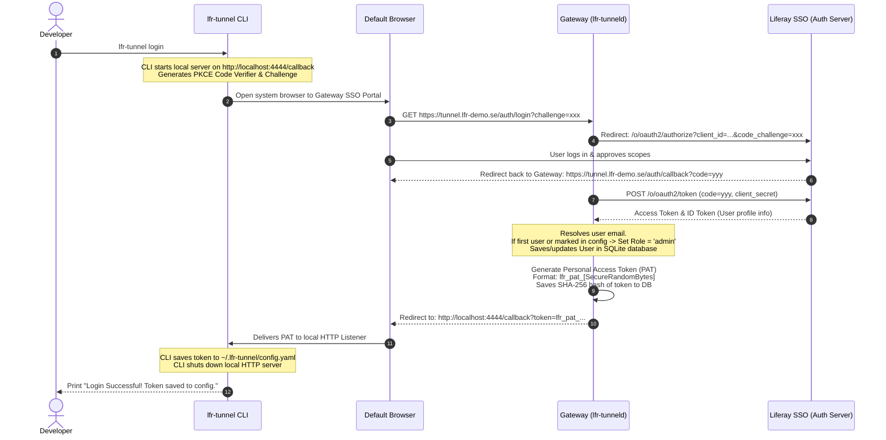

# lfr-tunnel Token Lifecycle & OAuth2 SSO Integration Architecture

This document describes the technical architecture, database schema, API endpoints, and sequence flows required to migrate `lfr-tunnel` from a single shared authentication token to a secure, multi-tenant system with **OAuth2 Liferay SSO**, **per-user Personal Access Tokens (PATs)**, and **Role-Based Access Control (RBAC)**.

---

## 1. Core Architecture Overview

```mermaid
graph TD
    subgraph Developer Machine
        CLI[lfr-tunnel CLI]
        Browser[System Browser]
    end

    subgraph Gateway Server (lfr-tunneld)
        API[Gateway Web Server]
        DB[(SQLite / PostgreSQL)]
        Chisel[Embedded Chisel Server]
    end

    subgraph Identity Provider
        SSO[Liferay Portal SSO / OAuth2]
    end

    CLI -->|1. lfr-tunnel login| API
    API -->|2. Redirect| Browser
    Browser -->|3. Authenticate| SSO
    SSO -->|4. Auth Code| API
    API -->|5. Exchange Code & Sync User| SSO
    API -->|6. Write User & Token| DB
    API -->|7. Return PAT| CLI
    CLI -->|8. Register Tunnel (with PAT)| API
    API -->|9. Validate PAT| DB
    API -->|10. Authorize Session| Chisel
```

---

## 2. Database Schema (User, Roles, and Tokens)

To support this multi-user capability, the server gateway utilizes a lightweight persistent relational database (such as **SQLite** for zero-config deployments, or **PostgreSQL** for scalable production systems).

### SQL Table Schema

```sql
-- Users table storing synchronized profile data from Liferay SSO or static admin provisioning
CREATE TABLE users (
    id VARCHAR(64) PRIMARY KEY,          -- Unique user ID (e.g. Liferay user uuid or email)
    email VARCHAR(255) UNIQUE NOT NULL,
    first_name VARCHAR(100),
    last_name VARCHAR(100),
    role VARCHAR(20) NOT NULL DEFAULT 'user', -- 'admin' or 'user'
    is_active BOOLEAN NOT NULL DEFAULT TRUE,
    created_at TIMESTAMP NOT NULL DEFAULT CURRENT_TIMESTAMP,
    updated_at TIMESTAMP NOT NULL DEFAULT CURRENT_TIMESTAMP
);

-- Personal Access Tokens (PATs) table for client connections
CREATE TABLE personal_access_tokens (
    id INTEGER PRIMARY KEY AUTOINCREMENT,
    user_id VARCHAR(64) NOT NULL,
    token_hash VARCHAR(64) UNIQUE NOT NULL, -- SHA-256 hash of the generated token string
    token_prefix VARCHAR(10) NOT NULL,       -- Visible prefix (e.g., lfr_pat_abcd) for display in Admin UI
    name VARCHAR(100) NOT NULL,              -- Friendly label (e.g., "Macbook Pro", "Jenkins Agent")
    expires_at TIMESTAMP NULL,               -- Optional token expiration date
    revoked_at TIMESTAMP NULL,               -- Revocation timestamp (null if active)
    last_used_at TIMESTAMP NULL,             -- Audit tracking for last active connection
    created_at TIMESTAMP NOT NULL DEFAULT CURRENT_TIMESTAMP,
    FOREIGN KEY(user_id) REFERENCES users(id) ON DELETE CASCADE
);

-- Audit log of active and historical tunnel leases
CREATE TABLE tunnel_audit_logs (
    id INTEGER PRIMARY KEY AUTOINCREMENT,
    user_id VARCHAR(64) NOT NULL,
    subdomain_prefix VARCHAR(100) NOT NULL,
    ports TEXT NOT NULL,                     -- Comma-separated list of mapped ports
    remote_ip VARCHAR(45) NOT NULL,
    connected_at TIMESTAMP NOT NULL DEFAULT CURRENT_TIMESTAMP,
    disconnected_at TIMESTAMP NULL,
    FOREIGN KEY(user_id) REFERENCES users(id) ON DELETE SET NULL
);
```

---

## 3. OAuth2 Authorization Code Flow with PKCE

Once Liferay SSO is available, the CLI will utilize standard **OAuth2 with PKCE (RFC 7636)** to authenticate developers against the Liferay SSO Server.

### Login Flow Sequence



---

## 4. Administrative Developer Token Provisioning (Pre-SSO / Local UX Setup)

To support secure user management, individual developer auditing, and revocation **before Liferay SSO is integrated**, the gateway server supports static token provisioning via configuration files. 

This avoids the insecurity of a single shared token and bypasses the need for mock backdoor login pages or temporary registration screens.

### 4.1. Configuration-based User Tokens (`developer-tokens.yaml`)
Admins provision tokens directly on the VPS by maintaining a YAML configuration file at `/etc/lfr-tunneld/developer-tokens.yaml`:

```yaml
tokens:
  - email: "admin@lfr-demo.se"
    token_hash: "8f5e2894427814d58262685f56571aef3f772fb7973f9d063f423de3173e97cb" # SHA-256 hash of "lfr_pat_peter_secret_123"
    description: "Peter's Macbook Pro"
    role: "admin"
    expires_at: "2027-12-31T23:59:59Z"
  - email: "developer@liferay.com"
    token_hash: "4fc2d409d6c703b715694294025fbc70..."
    description: "Dev workstation"
    role: "user"
    expires_at: "2026-09-30T23:59:59Z"
```

### 4.2. CLI Generation Tool
The gateway binary `lfr-tunneld` can include a token helper command for admins running on the VPS terminal to easily generate hashes and values:

```bash
# Generate a new secure token for a developer
lfr-tunneld token create --email developer@liferay.com --desc "Dev workstation"
```
*   **Output**:
    ```text
    Generated Token: lfr_pat_dev_8a7d9f2e4b6c8d0e
    SHA-256 Hash:    8b3c9d...
    
    Please add the SHA-256 Hash to /etc/lfr-tunneld/developer-tokens.yaml
    ```

### 4.3. Revocation and Verification
*   **Authentication**: When a client CLI registers a tunnel, it sends their unique token. The server hashes it and verifies it against the active list.
*   **Revocation**: To revoke a developer's access, the admin deletes their entry from `developer-tokens.yaml` and sends a `SIGHUP` signal to the `lfr-tunneld` daemon, which reloads the configuration immediately and closes any active tunnels associated with that token.

---

## 5. API Specification & Integration Points

### Control Plane REST API

The gateway server exposes the following endpoints:

#### 1. Registration (`POST /api/register`)
Exchanges a PAT for a dynamic Chisel tunnel lease.
*   **Request Payload**:
    ```json
    {
      "subdomain_prefix": "alpha-se",
      "ports": [
        { "local_port": 8080, "name_suffix": "" },
        { "local_port": 3001, "name_suffix": "react" }
      ],
      "personal_access_token": "lfr_pat_dev_8a7d9f2e4b6c8d0e"
    }
    ```
*   **Server Logic**:
    1. Hashes incoming token: `sha256("lfr_pat_dev_8a7d9f2e4b6c8d0e")`.
    2. Queries the local DB or loaded static configurations.
    3. Validates that the token is active, not expired, and not revoked.
    4. If valid, registers the tunnel and logs connection details.
    5. Returns `session_token` and remote mappings.

---

### Administrative Control Plane API (Admins Only)

These endpoints require an administrative session (only active after Liferay SSO is deployed) or an administrative API header token.

#### 1. List Users (`GET /api/admin/users`)
*   **Response**:
    ```json
    [
      {
        "id": "admin",
        "email": "admin@lfr-demo.se",
        "role": "admin",
        "is_active": true
      }
    ]
    ```

#### 2. Modify User Role / Status (`POST /api/admin/users/:id`)
*   **Request Payload**:
    ```json
    {
      "role": "admin",
      "is_active": false
    }
    ```
*   **Logic**: Updates the user record. If `is_active` is set to `false`, immediately revokes all of their active Chisel tunnel connections.

---

## 6. Security & Isolation Measures

1.  **Token Hashing (At Rest Security)**:
    Only SHA-256 hashes of generated tokens (`token_hash`) are stored in configurations or databases. If the database/configuration files on the server are compromised, attackers cannot reconstruct the tokens.
2.  **Active Connection Termination**:
    When an admin revokes a token or deactivates a user, the gateway server sweeps all active Chisel sessions and immediately terminates any corresponding WebSockets.
3.  **Bootstrap Admin Role**:
    An environment variable `LFT_BOOTSTRAP_ADMIN` can be set. When this email logs in for the first time via Liferay SSO, the system automatically marks them as `admin`.

---

## 7. Implementation & Transition Plan

1.  **Step 1: Token Config Parser**: Implement the configuration loading and `SIGHUP` reload listener for `developer-tokens.yaml` on the server gateway.
2.  **Step 2: Database Setup**: Add SQLite engine for auditing active leases and mapping sessions.
3.  **Step 3: Authenticator Middleware**: Update token checking in `pkg/server/server.go` to validate against the configuration file tokens.
4.  **Step 4: SSO Endpoints (Future Phase)**: Implement OIDC handshake `/auth/login` and `/auth/callback` to automate token acquisition once Liferay SSO client registration is complete.
