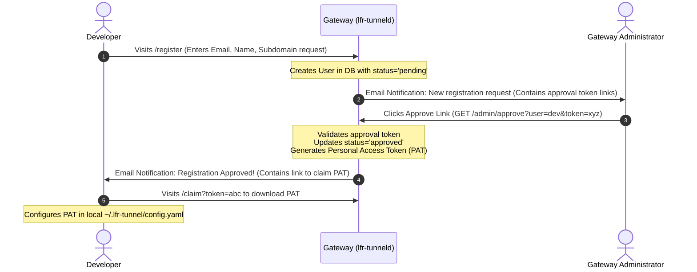
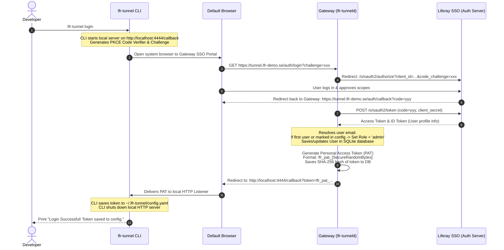

# lfr-tunnel Token Lifecycle & OAuth2 SSO Integration Architecture

This document describes the technical architecture, database schema, API endpoints, and sequence flows required to migrate `lfr-tunnel` from a single shared authentication token to a secure, multi-tenant system with **OAuth2 Liferay SSO**, **per-user Personal Access Tokens (PATs)**, and **Role-Based Access Control (RBAC)**.

---

## 1. Core Architecture Overview

```mermaid
graph TD
    subgraph Developer Machine
        CLI[lfr-tunnel CLI]
        Browser[System Browser]
    end

    subgraph Gateway Server (lfr-tunneld)
        API[Gateway Web Server]
        DB[(SQLite / PostgreSQL)]
        Chisel[Embedded Chisel Server]
    end

    subgraph Identity Provider
        SSO[Liferay Portal SSO / OAuth2]
    end

    CLI -->|1. lfr-tunnel login| API
    API -->|2. Redirect| Browser
    Browser -->|3. Authenticate| SSO
    SSO -->|4. Auth Code| API
    API -->|5. Exchange Code & Sync User| SSO
    API -->|6. Write User & Token| DB
    API -->|7. Return PAT| CLI
    CLI -->|8. Register Tunnel (with PAT)| API
    API -->|9. Validate PAT| DB
    API -->|10. Authorize Session| Chisel
```

---

## 2. Database Schema (User, Roles, and Tokens)

To support this multi-user capability, the server gateway utilizes a lightweight persistent relational database (such as **SQLite** for zero-config deployments, or **PostgreSQL** for scalable production systems).

### SQL Table Schema

```sql
-- Users table storing profile data and registration states
CREATE TABLE users (
    id VARCHAR(64) PRIMARY KEY,          -- Unique user ID (e.g. Liferay user uuid or email)
    email VARCHAR(255) UNIQUE NOT NULL,
    first_name VARCHAR(100),
    last_name VARCHAR(100),
    role VARCHAR(20) NOT NULL DEFAULT 'user', -- 'admin' or 'user'
    status VARCHAR(20) NOT NULL DEFAULT 'pending', -- 'pending', 'approved', 'revoked'
    created_at TIMESTAMP NOT NULL DEFAULT CURRENT_TIMESTAMP,
    updated_at TIMESTAMP NOT NULL DEFAULT CURRENT_TIMESTAMP
);

-- Personal Access Tokens (PATs) table for client connections
CREATE TABLE personal_access_tokens (
    id INTEGER PRIMARY KEY AUTOINCREMENT,
    user_id VARCHAR(64) NOT NULL,
    token_hash VARCHAR(64) UNIQUE NOT NULL, -- SHA-256 hash of the generated token string
    token_prefix VARCHAR(10) NOT NULL,       -- Visible prefix (e.g., lfr_pat_abcd) for display in Admin UI
    name VARCHAR(100) NOT NULL,              -- Friendly label (e.g., "Macbook Pro", "Jenkins Agent")
    expires_at TIMESTAMP NULL,               -- Optional token expiration date
    revoked_at TIMESTAMP NULL,               -- Revocation timestamp (null if active)
    last_used_at TIMESTAMP NULL,             -- Audit tracking for last active connection
    created_at TIMESTAMP NOT NULL DEFAULT CURRENT_TIMESTAMP,
    FOREIGN KEY(user_id) REFERENCES users(id) ON DELETE CASCADE
);

-- Audit log of active and historical tunnel leases
CREATE TABLE tunnel_audit_logs (
    id INTEGER PRIMARY KEY AUTOINCREMENT,
    user_id VARCHAR(64) NOT NULL,
    subdomain_prefix VARCHAR(100) NOT NULL,
    ports TEXT NOT NULL,                     -- Comma-separated list of mapped ports
    remote_ip VARCHAR(45) NOT NULL,
    connected_at TIMESTAMP NOT NULL DEFAULT CURRENT_TIMESTAMP,
    disconnected_at TIMESTAMP NULL,
    FOREIGN KEY(user_id) REFERENCES users(id) ON DELETE SET NULL
);
```

---

## 3. Developer Self-Registration & Admin Approval Flow (Pre-SSO)

Before Liferay SSO is fully integrated, developers can request access directly via the gateway. To prevent unauthorized use, all registration requests must go through an email-based administrative approval flow.

### Sequence Flow Diagram



### 3.1. Key Steps in the Approval Flow
1.  **Request Submission**: The developer visits the public landing page `/register` and submits their details.
2.  **Admin Alert Email**: The server fires a transactional email to the configured administrator's address. The email contains:
    *   Developer Name and Email.
    *   Requested subdomain prefix.
    *   A secure approval link: `https://tunnel.lfr-demo.se/admin/approve?user=developer@liferay.com&token=[SecureRandomApprovalToken]`
3.  **Approval Validation**: When the admin clicks the link, the server verifies the approval token against the database. If it matches, the user is transitioned to `approved` status, and a unique PAT is generated.
4.  **Developer Delivery Email**: The server emails the developer containing a link to download their token securely or complete their CLI setup.

---

## 4. OAuth2 Authorization Code Flow with PKCE (Future Phase)

Once Liferay SSO is available, this flow will replace the manual approval process. Developers will authenticate directly using Liferay Portal.

### Login Flow Sequence



---

## 5. Outbound Email Configuration (Local Postfix vs. External SMTP Relay)

To support sending transactional emails (such as request notifications to the admin and approval emails to the developers) securely, the server connects to an outbound mail relay.

The server supports two configuration modes:
1.  **Local MTA (Null Client)**: Connecting to `127.0.0.1:25` where a local Postfix server is configured to deliver mail.
2.  **External SMTP Relay**: Connecting to an external email provider (such as Gmail, AWS SES, or Liferay's Google Workspace SMTP) using TLS.

### Server SMTP Configuration (`server-config.yaml`)

```yaml
smtp_host: "localhost"              # SMTP Server address (e.g. localhost or smtp.gmail.com)
smtp_port: 25                       # SMTP Port (e.g. 25, 587 for STARTTLS, or 465 for SSL)
smtp_username: ""                   # SMTP Username (leave empty for local Postfix)
smtp_password: ""                   # SMTP Password
smtp_from_address: "Liferay Tunnel <noreply@lfr-demo.se>"
admin_notification_email: "admin@lfr-demo.se"
```

---

## 6. API Specification & Integration Points

### Control Plane REST API

The gateway server exposes the following endpoints:

#### 1. Registration (`POST /api/register`)
Exchanges a PAT for a dynamic Chisel tunnel lease.
*   **Request Payload**:
    ```json
    {
      "subdomain_prefix": "alpha-se",
      "ports": [
        { "local_port": 8080, "name_suffix": "" },
        { "local_port": 3001, "name_suffix": "react" }
      ],
      "personal_access_token": "lfr_pat_dev_8a7d9f2e4b6c8d0e"
    }
    ```
*   **Server Logic**:
    1. Hashes incoming token: `sha256("lfr_pat_dev_8a7d9f2e4b6c8d0e")`.
    2. Queries database: `SELECT * FROM personal_access_tokens WHERE token_hash = ?`.
    3. Validates that the associated user's status is `approved` and the token is not expired/revoked.
    4. Registers the tunnel lease on Chisel.

---

### Administrative Control Plane API (Admins Only)

These endpoints require an administrative session or an administrative token.

#### 1. List Users (`GET /api/admin/users`)
*   **Response**:
    ```json
    [
      {
        "id": "admin",
        "email": "admin@lfr-demo.se",
        "role": "admin",
        "status": "approved"
      }
    ]
    ```

#### 2. Modify User Role / Status (`POST /api/admin/users/:id`)
*   **Request Payload**:
    ```json
    {
      "role": "admin",
      "status": "revoked"
    }
    ```
*   **Logic**: Updates the user status. If status is set to `revoked`, immediately closes all corresponding active WebSocket connections.

---

## 7. Security & Isolation Measures

1.  **Token Hashing (At Rest Security)**:
    Only SHA-256 hashes of generated tokens (`token_hash`) are stored in configurations or databases. If the database/configuration files on the server are compromised, attackers cannot reconstruct the tokens.
2.  **Active Connection Termination**:
    When an admin revokes a token or deactivates a user, the gateway server sweeps all active Chisel sessions and immediately terminates any corresponding WebSockets.
3.  **Bootstrap Admin Role**:
    An environment variable `LFT_BOOTSTRAP_ADMIN` can be set. When this email logs in for the first time via Liferay SSO, the system automatically marks them as `admin`.

---

## 8. Implementation & Transition Plan

1.  **Step 1: Database Setup**: Add SQLite database containing users (with status tracking) and tokens.
2.  **Step 2: SMTP Integration**: Implement standard `net/smtp` client connection code inside `pkg/server/mail.go` to handle admin alerts and developer token approvals.
3.  **Step 3: Registration and Approval API**: Implement `/register` forms, approval validation endpoint (`/admin/approve`), and email notification triggers.
4.  **Step 4: SSO Endpoints (Future Phase)**: Implement OIDC handshake `/auth/login` and `/auth/callback` to automate token acquisition once Liferay SSO client registration is complete.
