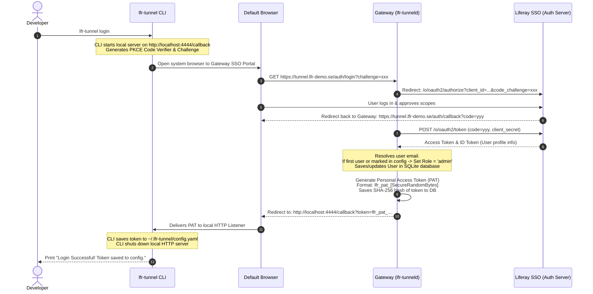

# lfr-tunnel Token Lifecycle & OAuth2 SSO Integration Architecture

This document describes the technical architecture, database schema, API endpoints, and sequence flows required to migrate `lfr-tunnel` from a single shared authentication token to a secure, multi-tenant system with **OAuth2 Liferay SSO**, **per-user Personal Access Tokens (PATs)**, and **Role-Based Access Control (RBAC)**.

---

## 1. Core Architecture Overview

```mermaid
graph TD
    subgraph Developer Machine
        CLI[lfr-tunnel CLI]
        Browser[System Browser]
    end

    subgraph Gateway Server (lfr-tunneld)
        API[Gateway Web Server]
        DB[(SQLite / PostgreSQL)]
        Chisel[Embedded Chisel Server]
    end

    subgraph Identity Provider
        SSO[Liferay Portal SSO / OAuth2]
    end

    CLI -->|1. lfr-tunnel login| API
    API -->|2. Redirect| Browser
    Browser -->|3. Authenticate| SSO
    SSO -->|4. Auth Code| API
    API -->|5. Exchange Code & Sync User| SSO
    API -->|6. Write User & Token| DB
    API -->|7. Return PAT| CLI
    CLI -->|8. Register Tunnel (with PAT)| API
    API -->|9. Validate PAT| DB
    API -->|10. Authorize Session| Chisel
```

---

## 2. Database Schema (User, Roles, and Tokens)

To support this multi-user capability, the server gateway will utilize a lightweight persistent relational database (such as **SQLite** for zero-config deployments, or **PostgreSQL** for scalable production systems).

### SQL Table Schema

```sql
-- Users table storing synchronized profile data from Liferay SSO
CREATE TABLE users (
    id VARCHAR(64) PRIMARY KEY,          -- Unique user ID (e.g. Liferay user uuid or email)
    email VARCHAR(255) UNIQUE NOT NULL,
    first_name VARCHAR(100),
    last_name VARCHAR(100),
    role VARCHAR(20) NOT NULL DEFAULT 'user', -- 'admin' or 'user'
    is_active BOOLEAN NOT NULL DEFAULT TRUE,
    created_at TIMESTAMP NOT NULL DEFAULT CURRENT_TIMESTAMP,
    updated_at TIMESTAMP NOT NULL DEFAULT CURRENT_TIMESTAMP
);

-- Personal Access Tokens (PATs) table for client connections
CREATE TABLE personal_access_tokens (
    id INTEGER PRIMARY KEY AUTOINCREMENT,
    user_id VARCHAR(64) NOT NULL,
    token_hash VARCHAR(64) UNIQUE NOT NULL, -- SHA-256 hash of the generated token string
    token_prefix VARCHAR(10) NOT NULL,       -- Visible prefix (e.g., lfr_pat_abcd) for display in Admin UI
    name VARCHAR(100) NOT NULL,              -- Friendly label (e.g., "Macbook Pro", "Jenkins Agent")
    expires_at TIMESTAMP NULL,               -- Optional token expiration date
    revoked_at TIMESTAMP NULL,               -- Revocation timestamp (null if active)
    last_used_at TIMESTAMP NULL,             -- Audit tracking for last active connection
    created_at TIMESTAMP NOT NULL DEFAULT CURRENT_TIMESTAMP,
    FOREIGN KEY(user_id) REFERENCES users(id) ON DELETE CASCADE
);

-- Audit log of active and historical tunnel leases
CREATE TABLE tunnel_audit_logs (
    id INTEGER PRIMARY KEY AUTOINCREMENT,
    user_id VARCHAR(64) NOT NULL,
    subdomain_prefix VARCHAR(100) NOT NULL,
    ports TEXT NOT NULL,                     -- Comma-separated list of mapped ports
    remote_ip VARCHAR(45) NOT NULL,
    connected_at TIMESTAMP NOT NULL DEFAULT CURRENT_TIMESTAMP,
    disconnected_at TIMESTAMP NULL,
    FOREIGN KEY(user_id) REFERENCES users(id) ON DELETE SET NULL
);
```

---

## 3. OAuth2 Authorization Code Flow with PKCE

The CLI utilizes standard **OAuth2 with PKCE (RFC 7636)** to authenticate developers against the Liferay SSO Server without requiring credentials to pass directly through the CLI or storing a permanent gateway secret client-side.

### Login Flow Sequence



---

### 3.1. Developer Backdoor / Mock SSO Flow (Local testing without Liferay SSO)

To support proof-of-concept testing, local developer environments, and scenarios where registering `lfr-tunnel` on the enterprise Liferay SSO server is delayed, the gateway server supports a **Mock SSO Bypass**.

*   **Activation**: Set the environment variable `LFT_MOCK_SSO=true` or start the gateway server with the `-mock-sso` flag.
*   **Bypassed Handshake**:
    1. When the developer runs `lfr-tunnel login`, the browser is directed to `https://tunnel.lfr-demo.se/auth/login`.
    2. Since `LFT_MOCK_SSO` is active, instead of redirecting the user to Liferay's external SSO endpoint, the server renders a beautiful, themed mockup login screen.
    3. The screen prompts the developer for a test **Email** (e.g. `admin@lfr-demo.se`) and **Display Name** (e.g. `Peter Richards`).
    4. Upon clicking "Login (Mock)", the server automatically accepts the credentials and simulates a successful SSO response.
    5. The server creates or updates the user profile in the database, generates a personal access token (PAT), and redirects the browser back to `http://localhost:4444/callback?token=lfr_pat_...` to save it locally.
    
This allows testing the complete database integration, token lifecycle management, expiration rules, and administration tools immediately.

---

## 4. API Specification & Integration Points

### Control Plane REST API

The gateway server exposes the following endpoints:

#### 1. Registration (`POST /api/register`)
Exchanges a PAT for a dynamic Chisel tunnel lease.
*   **Request Payload**:
    ```json
    {
      "subdomain_prefix": "alpha-se",
      "ports": [
        { "local_port": 8080, "name_suffix": "" },
        { "local_port": 3001, "name_suffix": "react" }
      ],
      "personal_access_token": "lfr_pat_abc123xyz"
    }
    ```
*   **Server Logic**:
    1. Hashes incoming token: `sha256("lfr_pat_abc123xyz")`.
    2. Queries `personal_access_tokens` joined with `users`.
    3. Validates that user `is_active` is true, the token is not expired (`expires_at > NOW` or null), and the token is not revoked (`revoked_at` is null).
    4. If valid, registers the tunnel and logs connection details into `tunnel_audit_logs`.
    5. Returns `session_token` and remote mappings.

---

### Administrative Control Plane API (Admins Only)

These endpoints require an administrative user session or an administrative header token.

#### 1. List Users (`GET /api/admin/users`)
*   **Response**:
    ```json
    [
      {
        "id": "admin",
        "email": "admin@lfr-demo.se",
        "first_name": "Peter",
        "last_name": "Richards",
        "role": "admin",
        "is_active": true
      }
    ]
    ```

#### 2. Modify User Role / Status (`POST /api/admin/users/:id`)
*   **Request Payload**:
    ```json
    {
      "role": "admin",
      "is_active": false
    }
    ```
*   **Logic**: Updates the user record. If `is_active` is set to `false`, immediately revokes all of their active Chisel tunnel connections and user leases.

#### 3. Revoke Token (`POST /api/admin/tokens/:id/revoke`)
*   **Logic**: Sets `revoked_at = CURRENT_TIMESTAMP` for the token. Immediately identifies if this token is currently associated with active `lfr-tunnel` leases and closes those WebSocket connections.

---

## 5. Security & Isolation Measures

1.  **Token Hashing (At Rest Security)**:
    Only SHA-256 hashes of generated tokens (`token_hash`) are stored in the database. If the database is compromised, attackers cannot reconstruct the tokens to establish unauthorized tunnels.
2.  **Active Connection Termination**:
    When an admin revokes a token or deactivates a user, the gateway server sweeps all active Chisel sessions. Any active WebSocket session authenticated with a lease derived from the revoked token is terminated via `registry.CleanLease(sessionToken)`, shutting down the public endpoint immediately.
3.  **Bootstrap Admin Role**:
    An environment variable `LFT_BOOTSTRAP_ADMIN` can be set (e.g. `LFT_BOOTSTRAP_ADMIN=admin@lfr-demo.se`). When this email logs in for the first time via Liferay SSO, the system automatically marks them as `admin`. This admin can then promote other users via the Admin Web Panel.

---

## 6. Implementation & Transition Plan

We can implement this system using a standard Go SQLite client package (like `modernc.org/sqlite` which requires no CGO, keeping the cross-compilation of `lfr-tunneld` easy).

1.  **Step 1: Database Setup**: Add SQLite engine, migrations, and database connection logic to `pkg/server/db.go`.
2.  **Step 2: Authenticator Middleware**: Rewrite token checking in `pkg/server/server.go` to support both legacy shared tokens (for backward compatibility if enabled) and new hashed PAT database lookups.
3.  **Step 3: OAuth2 Endpoints**: Implement `/auth/login`, `/auth/callback`, and static admin dashboard templates in the server.
4.  **Step 4: CLI Login Command**: Implement the PKCE flow code and local HTTP callback server inside a new command `lfr-tunnel login`.
5.  **Step 5: Admin UI Panel**: Serve a clean, glassmorphic administrative interface for managing users, roles, active tunnels, and tokens.
