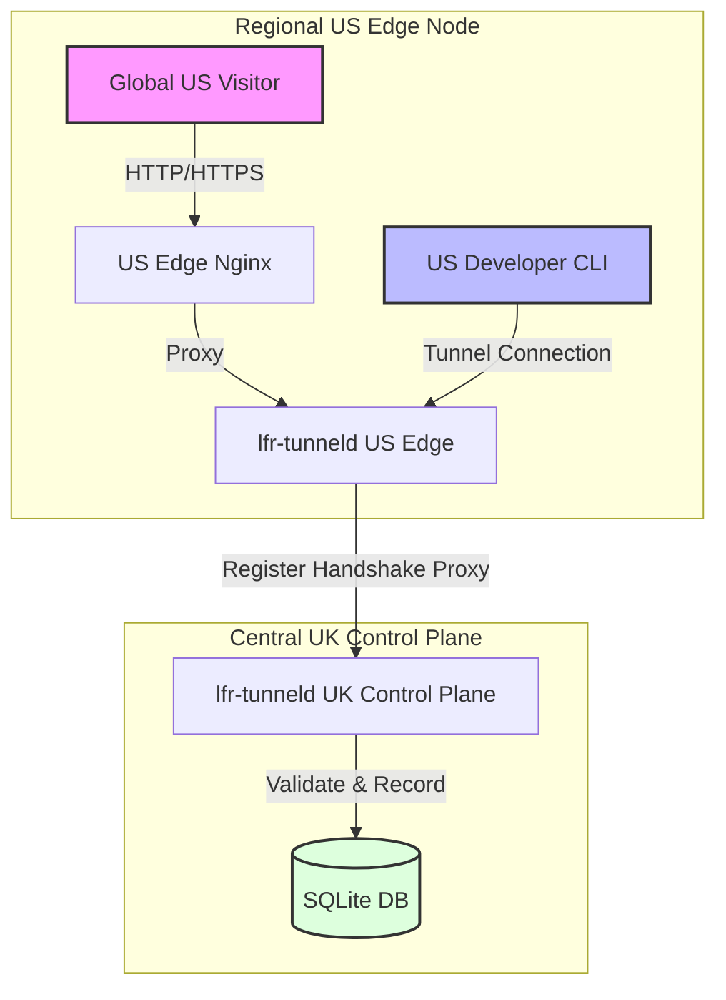

# Multi-Region Edge VPS Gateways Setup Guide

This guide describes how to configure and deploy the distributed multi-region edge architecture for `lfr-tunnel`. It covers single-node setups, multi-region routing, DNS mappings, wildcard SSL certificate provisioning, Nginx configurations, and client usage.

---

## 1. Architectural Overview

The multi-region setup consists of:
1. **Central Control Plane (Orchestrator)**: The primary gateway containing the master SQLite database. It manages user registrations, database records, dashboard pages, and authentication sessions.
2. **Stateless Edge Nodes (Regional Gateways)**: Distributed edge proxies deployed globally (e.g., US, APac). They terminate client tunnels and public visitor HTTP traffic regionally, reducing latency. Edge nodes maintain zero persistent state and validate registrations by proxying to the Control Plane.



---

## 2. Zero-Configuration Standalone Mode (No Edge Nodes)

If you do not require multi-region routing, **you do not need to configure any edge settings**. By default, `lfr-tunneld` runs as a standalone gateway.

To run in standalone mode:
* Set `db_path` in `server-config.yaml` to a valid file path.
* Do **not** set `control_plane_url`, `edge_token`, or `edge_nodes` in the configuration.
* Clients connecting to the standalone server will establish standard tunnels directly to the server.

---

## 3. DNS Configuration

For a multi-region deployment, configure DNS records as follows:

| Domain | DNS Record Type | Target IP | Description |
| :--- | :--- | :--- | :--- |
| `tunnel.lfr-demo.se` | `A` / `AAAA` | `UK_CONTROL_IP` | Primary control plane endpoint. |
| `*.lfr-demo.se` | `CNAME` | `tunnel.lfr-demo.se` | Default client tunnels domain. |
| `us.lfr-demo.online` | `A` / `AAAA` | `US_EDGE_IP` | Regional US Edge node gateway. |
| `*.us.lfr-demo.online` | `CNAME` | `us.lfr-demo.online` | Regional US client tunnels domain. |

---

## 4. Wildcard SSL Certificate Provisioning (ACME DNS-01)

Regional edge nodes require wildcard SSL certificates to secure dynamic visitor subdomains (e.g., `*.us.lfr-demo.online`).

Because HTTP-01 challenge validation cannot work for wildcard subdomains without complex dynamic routing, you must use the **ACME DNS-01** challenge.

### Example: Provisioning Wildcard Certs via Certbot & Cloudflare DNS API

1. Install Certbot and the Cloudflare DNS plugin on the server:
   ```bash
   sudo apt update
   sudo apt install certbot python3-certbot-dns-cloudflare
   ```

2. Create a restricted credentials file (e.g., `/etc/letsencrypt/cloudflare.ini`):
   ```ini
   dns_cloudflare_api_token = YOUR_CLOUDFLARE_API_TOKEN
   ```
   ```bash
   sudo chmod 600 /etc/letsencrypt/cloudflare.ini
   ```

3. Obtain the wildcard certificate:
   ```bash
   sudo certbot certonly \
     --dns-cloudflare \
     --dns-cloudflare-credentials /etc/letsencrypt/cloudflare.ini \
     -d "us.lfr-demo.online" \
     -d "*.us.lfr-demo.online" \
     --preferred-challenges dns-01
   ```

The certificate files will be generated at `/etc/letsencrypt/live/us.lfr-demo.online/`.

---

## 5. Gateway Configuration

### A. Central Control Plane Configuration (`server-config.yaml`)

On the control plane VPS, list authorized edge nodes and their token hashes:

```yaml
domains:
  - "lfr-demo.se"
bind_addr: ":443"
db_path: "/var/lib/lfr-tunneld/lfr-tunnel.db"

# Authorized Edge Nodes list
edge_nodes:
  - id: "us-east-1"
    token_hash: "4a2371ab6fbd2742e0fce40b2f3c1f94ecc8c02ad15f5455cd68bdf4e04f947a" # SHA-256 hash of plaintext token
```

#### Automated Edge Node Configuration Deployment

To automate updating the Control Plane configuration with your regional edge nodes list:
1. Create a local `edge_nodes.txt` file in the root of the repository matching the format in [edge_nodes.txt.example](file:///Volumes/SanDisk/repos/lfr-tunnel/edge_nodes.txt.example):
   ```text
   # Format: node_id,plaintext_token[,optional_public_url]
   us-east-1,my-plaintext-edge-token-us,https://us.lfr-demo.se
   apac-singapore:my-plaintext-edge-token-apac
   ```
2. Run the deployment script with the `-f` parameter:
   ```bash
   ./scripts/deploy.sh -i ~/.ssh/vps_key -f edge_nodes.txt
   ```

The script will automatically download the current configuration from the Control Plane VPS, calculate the SHA-256 hashes of the pre-shared tokens locally, append/update the `edge_nodes` section securely, upload it back to the VPS, apply restricted owner permissions, and restart `lfr-tunneld`.


### B. Regional Edge Gateway Configuration (`server-config.yaml`)

On the stateless edge node VPS, configure connection settings pointing to the Control Plane:

```yaml
domains:
  - "us.lfr-demo.online"
bind_addr: ":8090" # Port for local proxy / direct tunnels
db_path: "" # Explicitly empty db_path triggers stateless Edge Mode

control_plane_url: "https://tunnel.lfr-demo.se"
edge_token: "us-east-1-pre-shared-key-plaintext"
```

---

## 6. Nginx Reverse Proxy Configuration

### Central Control Plane Nginx Configuration
No special Nginx changes are needed on the Control Plane. Standard proxying to port `8080` (or whichever port `lfr-tunneld` binds) handles `/api/internal/` edge register calls automatically.

### Regional Edge Node Nginx Configuration

On the Edge node, configure Nginx to proxy client WebSocket handshakes and terminate SSL for regional visitor subdomains:

```nginx
map $http_upgrade $connection_upgrade {
    default upgrade;
    ''      close;
}

server {
    listen 80;
    listen [::]:80;
    server_name us.lfr-demo.online *.us.lfr-demo.online;
    return 301 https://$host$request_uri;
}

server {
    listen 443 ssl http2;
    listen [::]:443 ssl http2;
    server_name us.lfr-demo.online;

    ssl_certificate /etc/letsencrypt/live/us.lfr-demo.online/fullchain.pem;
    ssl_certificate_key /etc/letsencrypt/live/us.lfr-demo.online/privkey.pem;

    location /api/ {
        proxy_pass http://127.0.0.1:8090;
        proxy_set_header Host $http_host;
        proxy_set_header X-Real-IP $remote_addr;
    }

    location /tunnel {
        proxy_pass http://127.0.0.1:8090;
        proxy_http_version 1.1;
        proxy_set_header Upgrade $http_upgrade;
        proxy_set_header Connection $connection_upgrade;
        proxy_set_header Host $http_host;
        proxy_set_header X-Real-IP $remote_addr;
    }
}

server {
    listen 443 ssl http2;
    listen [::]:443 ssl http2;
    server_name *.us.lfr-demo.online;

    ssl_certificate /etc/letsencrypt/live/us.lfr-demo.online/fullchain.pem;
    ssl_certificate_key /etc/letsencrypt/live/us.lfr-demo.online/privkey.pem;

    location / {
        proxy_pass http://127.0.0.1:8090;
        proxy_http_version 1.1;
        proxy_set_header Upgrade $http_upgrade;
        proxy_set_header Connection $connection_upgrade;
        proxy_set_header Host $http_host;
        proxy_set_header X-Real-IP $remote_addr;
        proxy_set_header X-Forwarded-Host $http_host;
        proxy_set_header X-Forwarded-Proto https;
    }
}
```

---

## 7. Client CLI Usage & Latency Probing

### Configuring Regions
Define the available regional endpoints in the client configuration file `~/.lfr-tunnel/config.yaml`:

```yaml
server_url: "https://tunnel.lfr-demo.se"
regions:
  eu: "https://tunnel.lfr-demo.se"
  us: "https://us.lfr-demo.online"
  jp: "https://jp.lfr-demo.se"
```

### Option A: Explicit Region Target
Target a specific region using the `--region` flag:
```bash
lfr-tunnel --region us --subdomain my-tunnel --ports 8080
```

### Option B: Automatic Latency Probing (Default)
If the `--region` flag is omitted, the CLI concurrently probes `/api/healthz` on all configured regions and automatically establishes the tunnel on the lowest-latency regional gateway:
```bash
lfr-tunnel --subdomain my-tunnel --ports 8080
```
*Output:*
```text
[Client] No region specified. Performing latency auto-probing across 2 regions...
[Client] Auto-detected best region: 'us' -> https://us.lfr-demo.online
[Client] Connecting to gateway...
```

---

## 8. Asymmetric Outbound Routing Note

If your Edge VPS or Control Plane gateway has multiple public IP addresses configured, ensure you pin default outbound traffic source to the primary IP as described in the [asymmetric routing guide](setup_guide.md#9-asymmetric-outbound-routing-workaround-dual-ip-vps). This ensures that edge-health heartbeat requests, SMTP connections, and Let's Encrypt validation checks are not dropped by the provider's firewall.

