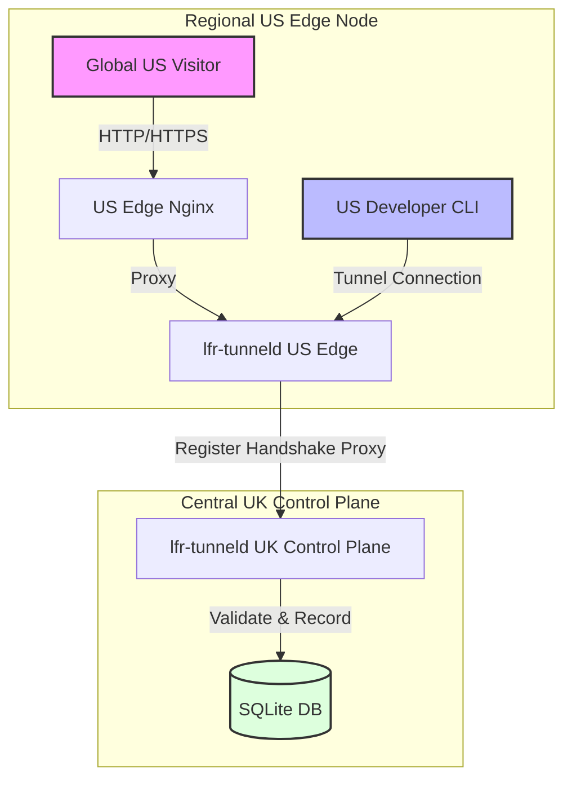

# Multi-Region Edge VPS Gateways Setup Guide

This guide describes how to configure and deploy the distributed multi-region edge architecture for `lfr-tunnel`. It covers single-node setups, multi-region routing, DNS mappings, wildcard SSL certificate provisioning, Nginx configurations, and client usage.

---

## 1. Architectural Overview

The multi-region setup consists of:
1. **Central Control Plane (Orchestrator)**: The primary gateway containing the master SQLite database. It manages user registrations, database records, dashboard pages, and authentication sessions.
2. **Stateless Edge Nodes (Regional Gateways)**: Distributed edge proxies deployed globally (e.g., US, APac). They terminate client tunnels and public visitor HTTP traffic regionally, reducing latency. Edge nodes maintain zero persistent state and validate registrations by proxying to the Control Plane.


```mermaid
graph TD
    subgraph Regional US Edge Node
        US_Visitor[Global US Visitor] -->|HTTP/HTTPS| US_Edge_Nginx[US Edge Nginx]
        US_Edge_Nginx -->|Proxy| US_Edge_Srv[lfr-tunneld US Edge]
        Developer[US Developer CLI] -->|Tunnel Connection| US_Edge_Srv
    end

    subgraph Central UK Control Plane
        US_Edge_Srv -->|Register Handshake Proxy| UK_Control_Srv[lfr-tunneld UK Control Plane]
        UK_Control_Srv -->|Validate & Record| UK_DB[(SQLite DB)]
    end

    style US_Visitor fill:#f9f,stroke:#333,stroke-width:2px
    style Developer fill:#bbf,stroke:#333,stroke-width:2px
    style UK_DB fill:#dfd,stroke:#333,stroke-width:2px
```

---

## 2. Zero-Configuration Standalone Mode (No Edge Nodes)

If you do not require multi-region routing, **you do not need to configure any edge settings**. By default, `lfr-tunneld` runs as a standalone gateway.

To run in standalone mode:
* Set `db_path` in `server-config.yaml` to a valid file path.
* Do **not** set `control_plane_url`, `edge_token`, or `edge_nodes` in the configuration.
* Clients connecting to the standalone server will establish standard tunnels directly to the server.

---

## 3. DNS Configuration

For a multi-region deployment, configure DNS records as follows:

| Domain | DNS Record Type | Target IP | Description |
| :--- | :--- | :--- | :--- |
| `tunnel.lfr-demo.se` | `A` / `AAAA` | `UK_CONTROL_IP` | Primary control plane endpoint. |
| `*.lfr-demo.se` | `CNAME` | `tunnel.lfr-demo.se` | Default client tunnels domain. |
| `us.lfr-demo.online` | `A` / `AAAA` | `US_EDGE_IP` | Regional US Edge node gateway. |
| `*.us.lfr-demo.online` | `CNAME` | `us.lfr-demo.online` | Regional US client tunnels domain. |

> [!NOTE]
> If provisioning an edge node (or the control plane) on AWS, see the
> [AWS EC2 Provisioning Guide](aws_setup_guide.md) first — it covers getting a stable
> `UK_CONTROL_IP`/`US_EDGE_IP` (an Elastic IP) before these DNS records are created.

---

## 4. Wildcard SSL Certificate Provisioning (ACME DNS-01)

Regional edge nodes require wildcard SSL certificates to secure dynamic visitor subdomains (e.g., `*.us.lfr-demo.online`).

Because HTTP-01 challenge validation cannot work for wildcard subdomains without complex dynamic routing, you must use the **ACME DNS-01** challenge.

### Example: Provisioning Wildcard Certs via Certbot & Cloudflare DNS API

1. Install Certbot and the Cloudflare DNS plugin on the server:
   ```bash
   sudo apt update
   sudo apt install certbot python3-certbot-dns-cloudflare
   ```

2. Create a restricted credentials file (e.g., `/etc/letsencrypt/cloudflare.ini`):
   ```ini
   dns_cloudflare_api_token = YOUR_CLOUDFLARE_API_TOKEN
   ```
   ```bash
   sudo chmod 600 /etc/letsencrypt/cloudflare.ini
   ```

3. Obtain the wildcard certificate:
   ```bash
   sudo certbot certonly \
     --dns-cloudflare \
     --dns-cloudflare-credentials /etc/letsencrypt/cloudflare.ini \
     -d "us.lfr-demo.online" \
     -d "*.us.lfr-demo.online" \
     --preferred-challenges dns-01
   ```

The certificate files will be generated at `/etc/letsencrypt/live/us.lfr-demo.online/`.

---

## 5. Gateway Configuration

### A. Central Control Plane Configuration (`server-config.yaml`)

On the control plane VPS, list authorized edge nodes and their token hashes:

```yaml
domains:
  - "lfr-demo.se"
bind_addr: ":443"
db_path: "/var/lib/lfr-tunneld/lfr-tunnel.db"

# Authorized Edge Nodes list
edge_nodes:
  - id: "edge-us" # a node ID, not an AWS region name -- keep these distinct even if
                   # the node happens to live in a region with a similar-looking name
    token_hash: "4a2371ab6fbd2742e0fce40b2f3c1f94ecc8c02ad15f5455cd68bdf4e04f947a" # SHA-256 hash of plaintext token
```

#### Rotating an Edge Node's Token

An edge token is long-lived and has no expiry. Rotating one used to mean a flag day — edit
central's config, restart it, re-provision every edge — with a window in which no edge could
authenticate. Central now accepts more than one hash per node, so a rotation is a rolling change
(#1491):

```yaml
edge_nodes:
  - id: "edge-us"
    token_hash: "<current>"
    additional_token_hashes:
      - "<incoming>"        # both authenticate while the rotation is in progress
```

1. Generate the new token and its hash, exactly as when registering a node.
2. Add the hash to `additional_token_hashes` on central and `sudo systemctl reload lfr-tunneld`.
3. Re-provision the edges one at a time with the new plaintext token. Each keeps working before
   and after, because both hashes are accepted.
4. Remove the old value from `token_hash` and reload central again. **This is the step that
   actually revokes the old token** — until then it still authenticates.

Both hashes are accepted on the `/api/internal/*` endpoints *and* on the control channel, where
the hash is used as an HMAC key rather than compared. A rotation that only covered the first would
leave an edge authenticating for registration while silently failing to establish its control
channel, losing schedule pushes, shutdown warnings and lease kicks.

#### Withdrawing an Edge Token

`sudo systemctl reload lfr-tunneld` re-reads `edge_nodes` and applies it immediately. Removing a
node, or removing a hash from one, takes effect on the next request — no restart, and no
interruption to any tunnel on any edge (#1309).

This used to require a restart, which meant an operator responding to a suspected leak had to
choose between revoking the credential and keeping the fleet up. Reload removes the choice, so
withdraw first and investigate afterwards.

Check it landed. The reload names what changed, by node id and never by value:

```bash
sudo systemctl reload lfr-tunneld
sudo journalctl -u lfr-tunneld -n 20 --no-pager | grep 'Edge node'
```

Two things to know before relying on it:

- **Only `edge_nodes` is re-read.** Every other field still needs a restart (#1454). The reload
  says so in its own log line, so a field that looks reloaded but is not cannot mislead you.
- **A config that does not parse changes nothing.** The running list is kept and the failure is
  logged, so a SIGHUP against a half-saved file cannot de-authenticate the fleet. Verify with
  `lfr-tunneld -check-config` first if you want to know before signalling (#1455).

#### Registering a New Edge Node with the Control Plane

Track your nodes' plaintext tokens locally in a gitignored `edge_nodes.txt` (format in
[edge_nodes.txt.example](https://github.com/peterrichards-lr/lfr-tunnel/blob/master/edge_nodes.txt.example)), then render the registry:

```bash
./bin/lfr-tunnel-ops render-edge-nodes
```

This hashes each token with SHA-256 locally — the plaintext is never printed, logged or
uploaded — and **derives** each `url` from `scripts/liferay/dns/lfr-demo-production.yaml`
rather than letting you type it. That matters: the url used to be hand-written, and three
of four came to name retired `aws-edge-*` hosts which resolve, through the zone wildcard,
to the control plane itself, so central advertised its own address as three separate
regions for weeks (#1449). A url written in the file is now checked against the spec and a
mismatch is an error.

The output contains token hashes and is for placing on the control plane — do not commit
it. Verify the result afterwards with `lfr-tunnel-ops check-config`, which re-checks the
live file against the same spec.

If you would rather do it by hand, the steps are: 

1. Generate a random plaintext token and its SHA-256 hash (never uploaded in plaintext):
   ```bash
   TOKEN="edge-<name>-$(openssl rand -hex 32)"
   echo -n "$TOKEN" | shasum -a 256 | awk '{print $1}'
   ```
2. SSH to the control plane and add an entry to its `server-config.yaml`'s `edge_nodes`
   list (`id`, `token_hash`, `url`) using the hash from step 1 — keep the plaintext
   `$TOKEN` for the edge node's own config in §B below, and record it in your local
   `edge_nodes.txt`.
3. Restore the file's ownership/permissions after editing —
   `chown lfr-tunnel:lfr-tunnel /etc/lfr-tunneld/server-config.yaml && chmod 600 ...`
   (substitute whatever user `lfr-tunneld` actually runs as on your system). **This step
   is easy to get wrong and will silently break the service**: setting it to
   `root:root` instead locks out the service user entirely, causing an immediate
   `permission denied` crash loop on the *next* restart — verify with
   `systemctl status lfr-tunneld` before moving on.
4. `sudo systemctl restart lfr-tunneld`. This briefly interrupts **every** currently
   active tunnel across **every** edge node, not just the new one — plan this for a
   quiet moment, or batch it with other pending edge-node registrations to only
   restart once.

Consider this section a candidate for automation (a script wrapping steps 1-4) if
you're registering nodes often enough for the manual process to become tedious.


### Control Plane Shutdown Warning Setting (`server-config.yaml`)

To configure advance WebSocket shutdown warning notifications sent to connected clients before a regional node enters scheduled downtime or soft maintenance:

```yaml
# Advance warning window (in minutes) sent to connected clients prior to node stop
edge_shutdown_warning_minutes: 5
```


### B. Regional Edge Gateway Configuration (`server-config.yaml`)

On the stateless edge node VPS, configure connection settings pointing to the Control Plane:

```yaml
domains:
  - "us.lfr-demo.online"   # regional name, for direct and internal addressing
  - "lfr-demo.online"      # the shared name visitors actually use
tunnel_domains:
  - "lfr-demo.online"      # tunnels are only ever issued here
bind_addr: ":8090" # Port for local proxy / direct tunnels
db_path: "" # Explicitly empty db_path triggers stateless Edge Mode

control_plane_url: "https://tunnel.lfr-demo.se"
edge_token: "edge-us-pre-shared-key-plaintext" # matches the "edge-us" id registered above
```

#### Why `tunnel_domains`

`domains` is what this gateway *answers* on; `tunnel_domains` is what it may *issue tunnels
on*. Without the second list, a tunnel registered through this edge could only ever be
`peters.us.lfr-demo.online` — the serving node baked into the visitor's URL. Move the client
to another gateway, which it now does deliberately ahead of a scheduled stop, and the URL
becomes something else entirely, breaking every link anyone was holding (#1285).

Set `tunnel_domains` to the shared domain on every edge, and the same tunnel is
`peters.lfr-demo.online` wherever it is served from. The region belongs in DNS resolution,
not in the name a visitor types. `scripts/common/setup-edge-vps.sh -a lfr-demo.online` writes
this for you. Entries that aren't also in `domains` are ignored at startup, with a log line
saying so — a gateway cannot issue a host it doesn't serve.

Two things must follow for an apex-issued host on an edge to be reachable by visitors: DNS
has to point that host at the node currently holding it (see `dns_hook` below), and that
node's certificate has to cover `*.lfr-demo.online` rather than only `*.us.lfr-demo.online`
(#1248).

### B2. Dynamic DNS — Only If The Address Can Change

`setup-edge-vps.sh -D <none|cloudflare|route53>`, defaulting to **none**.

A node with a static or elastic address does not need a DDNS updater, and installing one anyway
is actively harmful: it runs every five minutes, and if it cannot reach its provider it fails
and exits 0 — so `systemd` records success while the records go stale.

That is not hypothetical. Provisioning used to install a Cloudflare updater unconditionally and
enable it with the comment *"it will trigger but log a credential error until API token is
updated"* — an updater expected to fail from the moment it was provisioned. When the zones later
moved to Route53 it started failing for a completely different reason, and that failure looked
identical to the one everyone had learned to ignore. It ran broken for two weeks (#1300).

If the address genuinely can change, pick the provider serving your zone. Both reference
implementations live in `scripts/common/`:

| provider | script |
|---|---|
| `cloudflare` | `cloudflare-ddns-edge.sh` |
| `route53` | `route53-ddns-edge.sh` |

The Route53 one validates what it detects before publishing it, prefers instance metadata over a
third-party echo service, and **exits non-zero on failure** so a broken updater shows up as a
failed unit rather than a successful one.

Re-running provisioning with `-D none` removes any updater a previous run installed, so retiring
one is a re-provision rather than manual cleanup on every node.

---

### C. DNS That Follows The Tunnel (`dns_hook`)

Configured on the **control plane**, not on the edges — it is the only gateway that knows
which node holds which lease.

```yaml
# On the control plane's server-config.yaml
dns_hook: "/usr/local/bin/lfr-dns-hook-route53.sh"
dns_withdraw_grace: 90s   # optional; this is the default
```

Once `tunnel_domains` is set, a tunnel's name no longer says where it lives —
`peters.lfr-demo.online` is the same name on every gateway. The `*.lfr-demo.online` wildcard
sends it to the control plane, which is right only while the control plane is the one serving
it. For a tunnel held by an edge, a visitor has to reach that edge, so the control plane
publishes a specific record when the tunnel starts and withdraws it when it stops (#1247). A
specific record beats the wildcard, so the two coexist, and when the record is withdrawn the
name falls back to the wildcard — and therefore to the control plane's offline page rather
than to NXDOMAIN.

**The hook, not a DNS SDK.** `lfr-tunneld` has no cloud credentials and no provider code, for
the same reasons as the power hook in `pkg/ops`: the most exposed host in the deployment
should not carry a DNS-write credential, and one deployment's provider does not belong in
provider-neutral code. The contract is two commands:

```
<hook> upsert <fqdn> <target>   publish or replace the record, exit 0 on success
<hook> delete <fqdn>            withdraw it, exit 0 on success
```

`<target>` is a hostname that already resolves to the serving gateway (an edge's configured
`url`, or the control plane's), so a hook may write a CNAME, an ALIAS, or resolve it and write
an A record. `scripts/common/lfr-dns-hook-route53.sh` is the reference implementation — it
writes a short-TTL CNAME, with AWS credentials scoped to `route53:ChangeResourceRecordSets`
and `route53:ListResourceRecordSets` on the zones in play and nothing else. Supporting a
different provider means writing a sibling of that script, not patching `lfr-tunnel`.

**More than one tunnel domain.** A gateway can issue tunnels on several domains — here both
`lfr-demo.se` and `lfr-demo.online`, with users choosing per reservation — and each lives in
its own hosted zone. A single pinned zone id would send half the records to the wrong zone,
where Route53 rejects them, so the hook resolves the zone from the name it is writing:

```bash
# Explicit, and avoids an API call:
LFT_DNS_ZONES="lfr-demo.se=Z123456,lfr-demo.online=Z789012"

# Or set nothing and let it look the zone up, which needs route53:ListHostedZonesByName:
#   (no configuration at all -- the zone is found from the name)

# Or pin one zone, correct only for a single-domain deployment:
LFT_DNS_ZONE_ID="Z123456"
```

The longest matching domain wins, so a more specific entry overrides a broader one regardless
of the order they are written in.

**Why withdrawal waits.** A lease is cleaned up on *any* disconnect, including a laptop
sleeping. Deleting immediately would hammer the provider on ordinary reconnect churn and blank
the record on every blip, so a withdrawal waits out `dns_withdraw_grace` and abandons itself
if anything claims the name in the meantime. That is also what makes a planned move safe: the
new gateway publishes as it registers, and the old gateway's pending withdrawal then knows it
is stale rather than deleting the record that just replaced it.

### D. Distributing Renewed Certificates To The Edges (`#1302`)

The control plane renews the wildcards; an edge renews nothing. Something has to carry a
renewal outward, or an edge keeps serving the previous certificate until it expires -- a cliff
rather than a degradation.

Three scripts, on the principle that the receiving account never writes to the final location:

| script | runs as | does |
|---|---|---|
| `lfr-distribute-certs.sh` | root on the control plane | Certbot **deploy hook**; bundles and sends |
| `lfr-receive-certs.sh` | `certsync` on each edge | reads stdin into a staging directory |
| `lfr-install-certs.sh` | root on each edge, via one sudoers entry | validates, installs, reloads nginx |

On each edge:

```
# ~certsync/.ssh/authorized_keys
restrict,command="/usr/local/bin/lfr-receive-certs" ssh-ed25519 AAAA...control-plane

# /etc/sudoers.d/lfr-certsync
certsync ALL=(root) NOPASSWD: /usr/local/bin/lfr-install-certs
```

`restrict` disables pty, port, agent and X11 forwarding; the forced command means whatever the
caller asks for is ignored. A key that leaks from the control plane buys exactly one thing:
the ability to *offer* this node a bundle.

**What the installer refuses,** because offering is not the same as being trusted:

- a private key that does not match its certificate
- a certificate covering any name this node does not serve, read from the node's **own**
  `domains`/`tunnel_domains` rather than passed in
- a certificate no newer than the one installed -- a distribution mechanism that can roll back
  is one that can be used to
- anything with no `subjectAltName` at all

It then runs `nginx -t` before reloading, because this fires unattended from a renewal hook
where nobody is watching.

On the control plane:

```
# /etc/letsencrypt/renewal-hooks/deploy/50-lfr-distribute-certs
LFT_EDGE_TARGETS="certsync@in.lfr-demo.se,certsync@us.lfr-demo.se,..."
LFT_CERT_KEY=/etc/lfr-certsync/certsync.key     # root:root 0600
LFT_POWER_HOOK=/usr/local/bin/lfr-power-hook-aws.sh
LFT_POWER_HOOK_ENV="AWS_REGION=us-east-2,ap-northeast-1,sa-east-1,ap-south-1"
```

The key lives in its own root-owned directory rather than beside the server's configuration:
that directory belongs to the service account, which could otherwise replace the key that
reaches every edge.

`AWS_REGION` names the regions the **edges** are in, not the one the control plane runs in --
they are rarely the same, and a hook pointed at the control plane's own region finds no
instances and quietly wakes nothing. It takes a comma-separated list because the nodes one
control plane serves are routinely spread across regions; commas rather than spaces because
the value is passed through as a single word of environment.

#### Provisioning it

Two scripts install the whole chain, and they are safe to re-run:

```bash
# 1. The sending half. Prints the public key the edges need.
./scripts/common/setup-certsync-central.sh \
    -s tunnel.example.com -i ~/.ssh/central.pem -u ubuntu \
    -t "certsync@in.example.com,certsync@us.example.com" \
    -R "ap-south-1,us-east-2"

# 2. The receiving half, once per edge. -H collects that node's host key.
./scripts/common/setup-certsync-edge.sh \
    -s in.example.com -i ~/.ssh/in.pem -u ubuntu \
    -k "ssh-ed25519 AAAA...  # printed by step 1" \
    -H /tmp/edge-known-hosts

# 3. Re-run step 1 with -H so the control plane knows every node's host key.
./scripts/common/setup-certsync-central.sh ... -H /tmp/edge-known-hosts

# 4. Prove it, rather than assume it.
ssh ubuntu@tunnel.example.com 'sudo /etc/letsencrypt/renewal-hooks/deploy/50-lfr-distribute-certs'
```

**Host keys are collected, not scanned.** `-H` reads each node's host key over the session
already used to administer it, and installs it in the control plane's `known_hosts` before
anything is ever sent. The alternative -- letting the first delivery trust whoever answers on
port 22 -- puts a private key on the wire during exactly the one connection an impostor would
want to intercept. A node whose key could not be obtained is reported, and delivery to it
fails loudly rather than falling back to trust.

**The edge provisioner self-tests.** It finishes by running the privileged installer through
the sudoers grant, as `certsync`, against an empty staging directory. That exercises the
grant, the script and the parsing of the node's own domains, and installs nothing. A node that
cannot do this would otherwise have failed months later, at renewal, with an expired
certificate.

**The control plane needs to reach each edge on port 22.** This is the step most likely to be
missed, because nothing else in the deployment needs it: the edges' firewall rules are usually
written for operator access, and a control plane added later is silently dropped. It presents
as a delivery timeout, not as a permission error.

**Sleeping nodes are woken, not skipped.** `us` and `apac` power down for eight hours a day and
will sometimes be asleep when a renewal lands. With a power hook configured, such a node is
started, delivered to, and returned to the state it was found in -- the same contract deploys
use. Without one it is skipped *loudly*, and the hook exits non-zero: a renewal that reports
success while a node missed the new certificate is the same failure as a DDNS updater exiting
0 while doing nothing (#1300).

**Keep the TTL short.** This record follows a client between gateways; a long TTL pins
visitors to a node that no longer holds the tunnel for as long as it lasts. The reference hook
defaults to 60 seconds.

Unset `dns_hook` and none of this happens — DNS is left entirely alone, which is correct for a
single-gateway deployment where the wildcard already points at the only gateway there is.

---

## 6. Nginx Reverse Proxy Configuration

### Central Control Plane Nginx Configuration
No special Nginx changes are needed on the Control Plane. Standard proxying to port `8080` (or whichever port `lfr-tunneld` binds) handles `/api/internal/` edge register calls automatically.

### Regional Edge Node Nginx Configuration

On the Edge node, configure Nginx to proxy client WebSocket handshakes and terminate SSL for regional visitor subdomains:

Do not hand-write this. It is generated from the same template central uses, so the two cannot
drift apart (#1442):

```bash
go build -o bin/lfr-tunnel-ops ./cmd/lfr-tunnel-ops
./bin/lfr-tunnel-ops render-nginx-config -role edge \
  -domains us.lfr-demo.online \
  -apex-domains lfr-demo.online \
  -redirect-domain lfr-demo.online -port 8090
```

`setup-edge-vps.sh` calls exactly this during provisioning, and
`lfr-tunnel-ops reconcile-nginx -role edge` pushes it to a box that is already running -- which
is what did not exist before #1442, and why the edges ended up running a hand-written config
with no source in this repo (#1443).

What the rendered config contains, and why:

| block | purpose |
| --- | --- |
| `map $http_upgrade $connection_upgrade` | once per file; nginx errors on a duplicate `map` |
| `:80` for `<edge>` and `*.<edge>` | redirect to HTTPS. No ACME fallback: an edge issues no vanity certificates, so it has no fall-through window to protect (unlike central, #979) |
| `:443` for `<edge>` | the edge's own hostname. Browser traffic is redirected to the control plane -- there is no portal here -- while `/api/` and `/tunnel` are served locally |
| `:443` for `*.<edge>` | the regional data plane, certificate from `/etc/letsencrypt/live/<edge>/` |
| `:443` for `*.<apex>` | apex wildcards served edge-direct, certificate from `/etc/lfr-tunneld/certs/<apex>/` where certsync installs the bundle pushed from central |

Two things that are easy to get wrong:

- The shared apex goes in **`-apex-domains`**, never `-domains`. `-domains` renders the apex
  server block too, so every edge would claim the control plane's own hostname -- and nginx
  reports a duplicate `server_name` as a warning, not an error, so it passes `nginx -t` and
  silently steals traffic.
- Forwarded headers are **overwritten**, not appended (`$remote_addr`, never
  `$proxy_add_x_forwarded_for`), because an appended value's leftmost entry is caller-supplied
  and forgeable (#1325). Note the known gap for the central-to-edge hop in #1450.

---

## 7. Client CLI Usage & Latency Probing

### Configuring Regions
Define the available regional endpoints in the client configuration file `~/.lfr-tunnel/config.yaml`:

```yaml
server_url: "https://tunnel.lfr-demo.se"
regions:
  eu: "https://tunnel.lfr-demo.se"
  us: "https://us.lfr-demo.online"
  jp: "https://jp.lfr-demo.se"
```

### Option A: Explicit Region Target
Target a specific region using the `--region` flag:
```bash
lfr-tunnel --region us --subdomain my-tunnel --ports 8080
```

### Option B: Automatic Latency Probing (Default)
If the `--region` flag is omitted, the CLI concurrently probes `/api/healthz` on all configured regions and automatically establishes the tunnel on the lowest-latency regional gateway:
```bash
lfr-tunnel --subdomain my-tunnel --ports 8080
```
*Output:*
```text
[Client] No region specified. Performing latency auto-probing across 2 regions...
[Client] Auto-detected best region: 'us' -> https://us.lfr-demo.online
[Client] Connecting to gateway...
```

---

## 8. Asymmetric Outbound Routing Note

If your Edge VPS or Control Plane gateway has multiple public IP addresses configured, ensure you pin default outbound traffic source to the primary IP as described in the [asymmetric routing guide](setup_guide.md#9-asymmetric-outbound-routing-workaround-dual-ip-vps). This ensures that edge-health heartbeat requests, SMTP connections, and Let's Encrypt validation checks are not dropped by the provider's firewall.


<!-- markdownlint-disable MD049 -->
---
*Last Updated: 2026-08-27* | *Last Reviewed: 2026-08-27*
